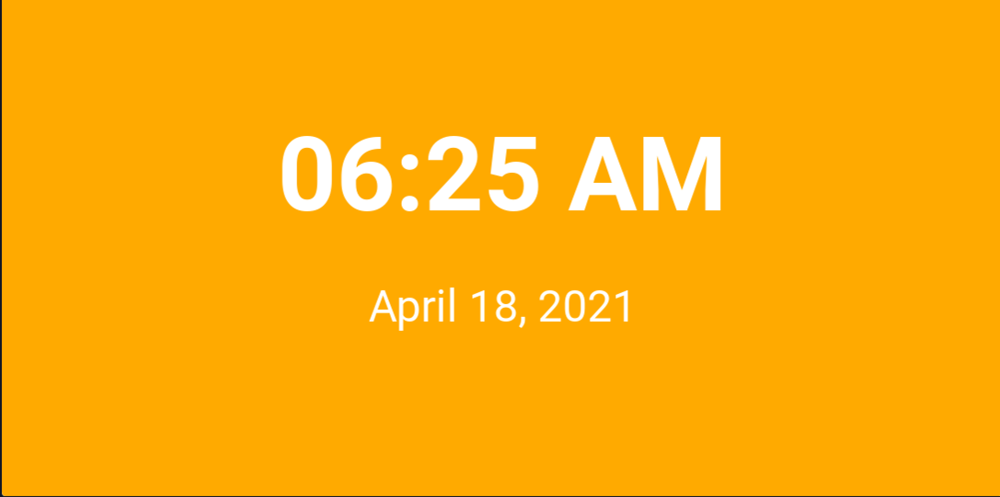
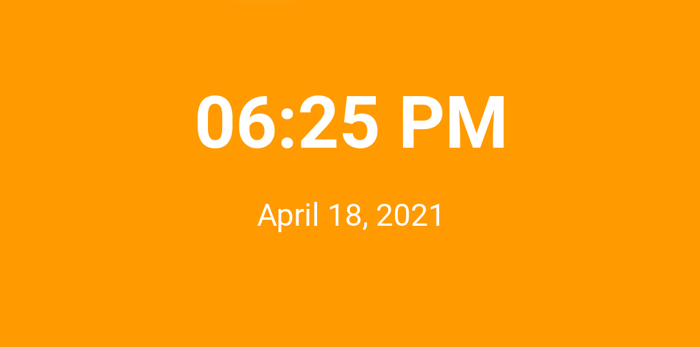
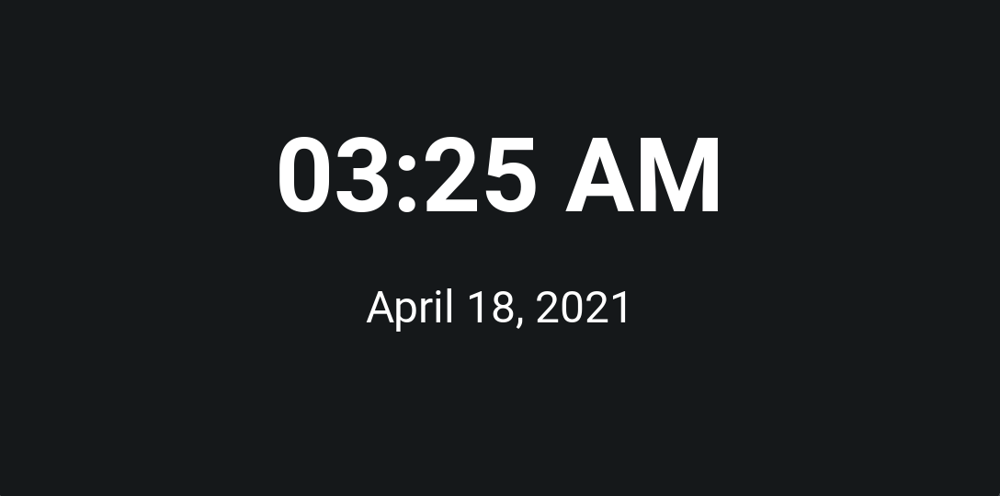
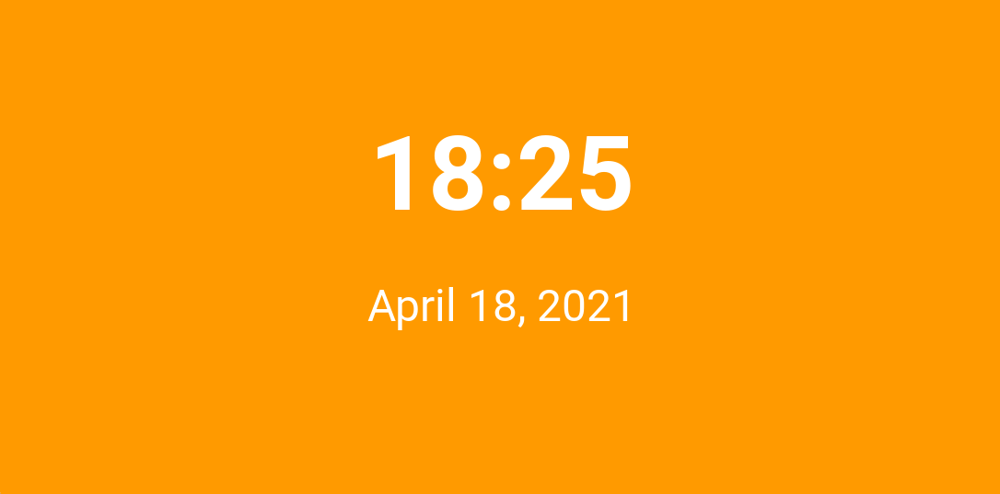

# DynamicClock
A clock that dynamically changes theme based on the time. Background color changes depending on time of day. 12/24 hour time can be toggled by clicking the time.

## Configuration
See src/config.js for parameters.

## Gallery

## License
**DynamicClock** is licensed under the [MIT License](https://github.com/willuhm-js/DynamicClock/blob/master/LICENSE)
